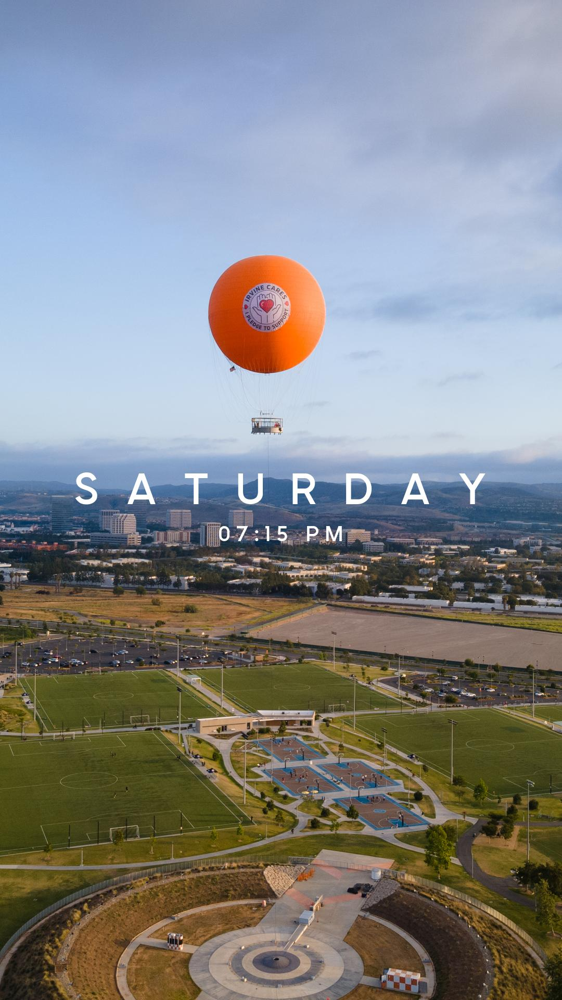
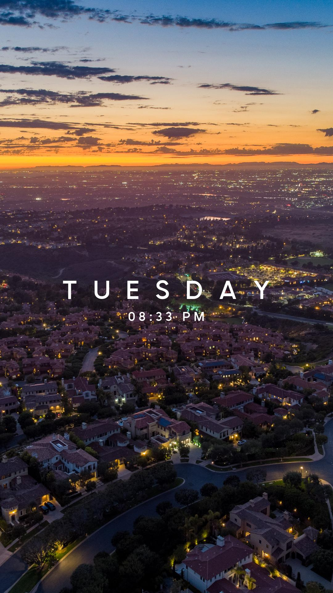
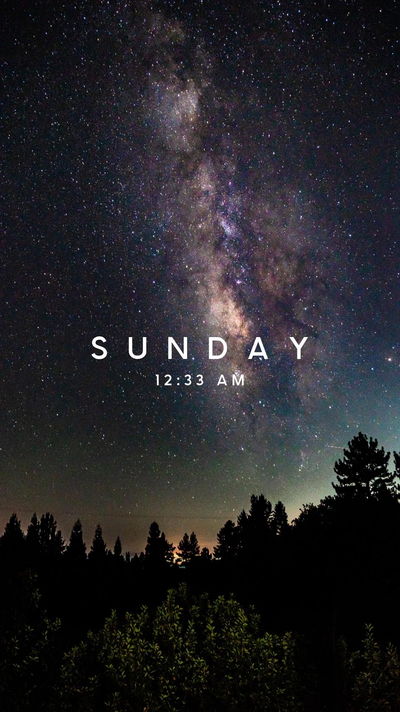

# Story Effects

## What this is

Instagram story effects, but it works on existing media.

## Where this is

[effects.willhsieh.com](https://effects.willhsieh.com/)

## When this is

Over the last three days, most of which was trying to figure out how to put it online.

## Why this is

I tried making an Instagram story effect that would work on existing media, but even if I check the box that says "allow existing media" it still doesn't work... so here we are.

## I still have more questions

This blog post goes into more detail: [Creating Instagram Story Effects But Better](https://willhsieh.com/posts/creating-instagram-story-effects-but-better/)

## I want to see it

Okay here you go:

## Sources I used

[Real Python - Flask](https://realpython.com/python-web-applications/)

[Miguel Grinberg - Handling File Uploads with Flask](https://blog.miguelgrinberg.com/post/handling-file-uploads-with-flask)

[Changing image aspect ratios](https://stackoverflow.com/a/4744625/16074281)

## License

MIT License

